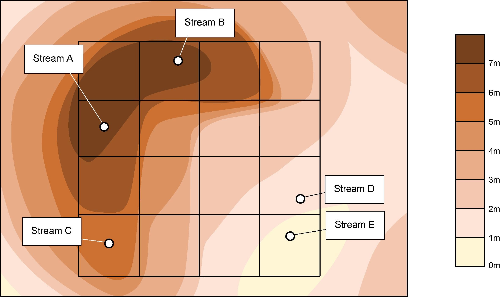

+++
title = "Projects"
slug = "projects"
+++

## (Finished) Optimisation of wastewater treatment strategies in eco-industrial parks: Technology, location and transport

### Background

The expanding population and rapid urbanisation, in particular in the Global South, are leading to global challenges on resource supply stress and rising waste generation. A transformation to resource-circular systems and sustainable recovery of carbon-containing and nutrient-rich waste offers a way to tackle such challenges. Eco-industrial parks have the potential to capture symbioses across individual waste producers, leading to more effective waste-recovery schemes. With whole-system design, economically attractive approaches can be achieved, reducing the environmental impacts while increasing the recovery of high-value resources. 

### Modelling

Within an eco-industrial park, there are various factories generating wastewater streams with different inflow rates and pollutant concentrations. Thus, the aim of the project was to find the optimal design strategy for wastewater treatment. In detail, the decision variables include location of treatment plants, wastewater treatment methods, and treatment technologies. The problem was formulated as a Mixed Integer Linear Programming program and solved by CPLEX.

### Conclusion

Optimal design of wastewater treatment strategies in the context of environmentally sustainable eco-industrial parks is a complex challenge comprising of multiple design objectives across a spatially distributed mix of waste producers. The difficulty of the task is increased with the transition towards a more resource-circular treatment approach, in which resource recovery technologies are implemented to enable valuable by-products to be extracted. A generic optimisation formulation is proposed in this study to enable suitable design decisions to be made in this context. Key features of the formulation are the inclusion of transport pipeline network design in addition to technology selection. The formulation allows for the value of recovered resources to be considered, encouraging a shift towards more sustainable treatment design and operation. Furthermore, discharge penalties and strict limits to contaminant discharge can be applied at the park-level. A set of design case-studies was presented to illustrate the deployment of the optimisation formulation in different scenarios. The impact of different design assumptions on the preferred solution was emphasised, highlighting the importance of taking a whole-system perspective at the design stage.The case studies particularly implied that an optimal treatment strategy is highly sensitive to the value of the resources recovered and to the penalties applied to the discharge of different waste components. The optimisation formulation developed here allows for such factors to be considered, thereby promoting a transition towards more resource efficient wastewater treatment.

